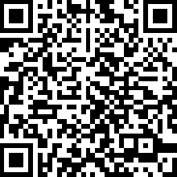

# 黑客马拉松
北京 ○ 2016
VR开发者、团队聚齐在一起，进行持续两天半的比赛。
认识朋友，体验VR盛宴，享受乐趣。

 @ 科技寺（望京）

 7月29日 18:00 － 22:00 启动大会; 
 7月30日 - 7月31日 正式比赛

 > 虚拟现实黑客松起源于旧金山，由Damon Hernandez和Mike Aratow组织的，旨在建设一个社区，专注于虚拟现实领域，将热衷于相关领域技术的最活跃的人聚集在一起，在软件、硬件和解决方案上创新，共享快乐。从2015年开始，虚拟现实黑客松在全球不同城市举办，每场举办都是由本地的团队负责，同时会获得来自Web3D联盟，不同的组织者、赞助商、世界范围的虚拟现实技术社区的支持。

## 组织者

* Rockq社区
Rockq 是一个开发者社区，开发者是一群想象力丰富，动手能力强的行动派。Rockq的组织者以及它服务的用户，是具有hacker精神的人。

* 科技寺
* iUND

## 赞助商

> 待定

# 奖品

> 待定

# 志愿者

## 我们希望你
居住在北京，年龄十八周岁以上，身体健康；

* Rockq社区社员优先，具有软件开发背景者优先。

* 具备强烈的责任感和执行力，有良好的沟通能力和现场协调能力。

* 本着以服务参赛选手，帮助协调现场运作的诚意，自愿加入志愿者团队。明确并知晓志愿者并非免费围观黑客马拉松的渠道；

* 志愿者工作时间为：

周六：8:30-18:00
周日：8:30-18:00

（具体工作时间根据现场负责人安排为准）；

* 志愿者现场大概职责范围
现场签到，分发礼品，分发三餐，分发食物（夜宵、零食和酒水等），现场摄影以及场内秩序维护，发布微博、微信社交媒体讯息等。

* 本次大赛全程两天
免费提供工作餐、饮品以及纪念 T-shirt一件。

志愿者是富有奉献和分享精神的人，在充当着本次黑客松幕后英雄点决赛，感谢每一个原来支援我们的朋友，共建一个繁荣、快乐点社区，大家一起度过一个充实愉快的周末。

[报名链接](http://form.mikecrm.com/vKOTZG)

# 观众票

可以凭观众票，到现场观看大会盛况，体验VR应用和专家、开发者进行交流互动。
购票办法，微信移动客户端扫一扫：

